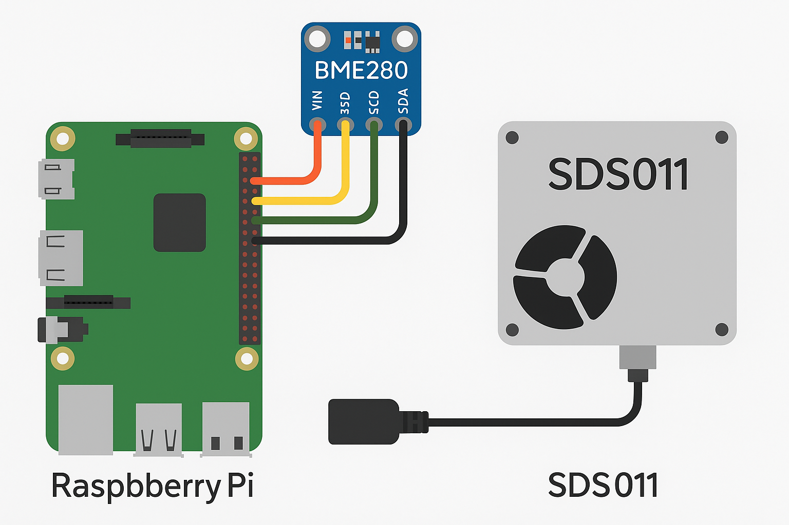

# Raspberry Pi Weather Station


[](https://codecov.io/gh/yourusername/rpi-weather-station)
[](https://coff.ee/tonifloritf)

A comprehensive weather station project for Raspberry Pi that collects data from various sensors and can send it to different destinations like APIs, MQTT brokers, SQS queues, or PostgreSQL databases.

## Features

- Collects temperature, humidity, and pressure data from BME280 sensors
- Measures air quality (PM2.5 and PM10) using SDS011 sensors
- Flexible data output options:
  - Console output
  - API endpoints
  - MQTT brokers
  - AWS SQS queues
  - PostgreSQL databases
- Configurable measurement intervals
- Runs as a system service

## Hardware Compatibility & Requirements

This project is fully compatible with the following Raspberry Pi models:
- **Raspberry Pi Zero 2 W/WH**
- **Raspberry Pi 3** (Model B, B+)
- **Raspberry Pi 4** (Model B - all RAM variants)
- **Raspberry Pi 5** (all RAM variants)

### Model-Specific Considerations

| Feature | Pi Zero 2 W | Pi 3 (B/B+) | Pi 4 | Pi 5 |
|---------|-------------|-------------|------|------|
| **GPIO Backend** | `RPi.GPIO` | `RPi.GPIO` | `RPi.GPIO` | `lgpio` / `blinka` |
| **Performance** | Good | Very Good | Excellent | Overkill |
| **I2C Setup** | Standard | Standard | Standard | Standard |
| **OS Support** | Bullseye/Bookworm | Bullseye/Bookworm | Bullseye/Bookworm | Bookworm (Required) |

> **Note for Raspberry Pi 5 Users:** The new RP1 I/O controller on the Pi 5 requires updated GPIO libraries. This project uses `adafruit-blinka` to abstract these differences, but ensure you are running the latest Raspberry Pi OS (Bookworm) and have installed system dependencies via `scripts/setup.sh`.

### Hardware Detection
The application automatically detects your Raspberry Pi model on startup and logs it. This ensures that any model-specific configurations (like sleep times or bus speeds) are applied correctly.

## Hardware Setup



### Enabling I2C for BME280 Sensor

The BME280 sensor communicates via I2C protocol, which needs to be enabled on your Raspberry Pi before the sensor can be used.

#### Method 1: Using raspi-config (Recommended)

1. Open the Raspberry Pi configuration tool:
   ```bash
   sudo raspi-config
   ```

2. Navigate to **Interfacing Options** (or **Advanced Options** on older versions)

3. Select **I2C**

4. Choose **Yes** to enable the I2C interface

5. Select **Finish** and reboot your Raspberry Pi:
   ```bash
   sudo reboot
   ```

#### Method 2: Manual Configuration

1. Edit the boot configuration file:
   ```bash
   sudo nano /boot/config.txt
   ```

2. Add or uncomment the following line:
   ```
   dtparam=i2c_arm=on
   ```

3. Edit the modules file:
   ```bash
   sudo nano /etc/modules
   ```

4. Add the following lines if they don't exist:
   ```
   i2c-bcm2708
   i2c-dev
   ```

5. Reboot your Raspberry Pi:
   ```bash
   sudo reboot
   ```

#### Verify I2C is Working

1. Install I2C tools:
   ```bash
   sudo apt-get update
   sudo apt-get install i2c-tools
   ```

2. Check if I2C devices are detected:
   ```bash
   sudo i2cdetect -y 1
   ```

3. You should see the BME280 sensor at address `77` (hexadecimal) if it's properly connected:
   ```
        0  1  2  3  4  5  6  7  8  9  a  b  c  d  e  f
   00:          -- -- -- -- -- -- -- -- -- -- -- -- -- 
   10: -- -- -- -- -- -- -- -- -- -- -- -- -- -- -- -- 
   20: -- -- -- -- -- -- -- -- -- -- -- -- -- -- -- -- 
   30: -- -- -- -- -- -- -- -- -- -- -- -- -- -- -- -- 
   40: -- -- -- -- -- -- -- -- -- -- -- -- -- -- -- -- 
   50: -- -- -- -- -- -- -- -- -- -- -- -- -- -- -- -- 
   60: -- -- -- -- -- -- -- -- -- -- -- -- -- -- -- -- 
   70: -- -- -- -- -- -- -- 77
   ```

#### BME280 Wiring

Connect your BME280 sensor to the Raspberry Pi as follows:

| BME280 Pin | Raspberry Pi Pin | Description |
|------------|------------------|-------------|
| VCC/VIN    | 3.3V (Pin 1)     | Power supply |
| GND        | GND (Pin 6)      | Ground |
| SCL        | GPIO 3 (Pin 5)   | I2C Clock |
| SDA        | GPIO 2 (Pin 3)   | I2C Data |

**Note**: Some BME280 modules may have different pin labels (VCC vs VIN, etc.). Refer to your specific module's documentation.

### Connecting SDS011 Sensor via USB

The SDS011 sensor connects to the Raspberry Pi via USB using a built-in USB-to-serial converter. This makes the connection much simpler than I2C sensors.

#### Physical Connection

1. Connect the SDS011 sensor to any available USB port on your Raspberry Pi using the provided USB cable.

2. The sensor should be automatically detected and assigned to `/dev/ttyUSB0` (or `/dev/ttyUSB1`, `/dev/ttyUSB2`, etc. if multiple USB serial devices are connected).

#### Verify USB Connection

1. Check if the sensor is detected:
   ```bash
   ls /dev/ttyUSB*
   ```

2. You should see output like:
   ```
   /dev/ttyUSB0
   ```

3. Check device information:
   ```bash
   dmesg | grep ttyUSB
   ```

4. You should see output similar to:
   ```
   [  123.456789] usb 1-1.4: ch341-uart converter now attached to ttyUSB0
   ```

#### Set USB Device Permissions

The application needs permission to access the USB serial device. You can either:

**Option 1: Add user to dialout group (Recommended)**
```bash
sudo usermod -a -G dialout $USER
```
Then log out and log back in for the changes to take effect.

**Option 2: Set device permissions manually**
```bash
sudo chmod 666 /dev/ttyUSB0
```
Note: This needs to be done each time the device is reconnected.

#### SDS011 Wiring (Internal)

The SDS011 sensor has an internal USB-to-serial converter, so no external wiring is required. The sensor connects directly via USB cable:

| SDS011 Component | Connection |
|------------------|------------|
| USB Connector    | Raspberry Pi USB Port |
| Power Supply     | 5V via USB |
| Data Communication | Serial via USB (appears as /dev/ttyUSB0) |

#### Troubleshooting USB Connection

If the sensor is not detected:

1. **Check USB cable**: Ensure you're using a data cable, not just a charging cable.

2. **Check USB ports**: Try different USB ports on the Raspberry Pi.

3. **Check device detection**:
   ```bash
   lsusb
   ```
   Look for a device with ID similar to `1a86:7523 QinHeng Electronics HL-340 USB-Serial adapter`.

4. **Check kernel modules**:
   ```bash
   lsmod | grep ch341
   ```
   The `ch341` module should be loaded for most SDS011 sensors.

5. **Manual module loading** (if needed):
   ```bash
   sudo modprobe ch341
   ```

**Note**: The SDS011 sensor may take a few seconds to initialize after being connected. Wait at least 30 seconds after connection before running the application.

## Installation

### Clone the Repository

```bash
git clone https://github.com/yourusername/rpi-weather-station.git
cd rpi-weather-station
```

### Set Up Environment

1. Create and activate a virtual environment:

```bash
python -m venv .venv
source .venv/bin/activate  # On Unix/macOS
# or
.venv\Scripts\activate  # On Windows
```

2. Install dependencies:

```bash
pip install -r requirements/requirements.txt  # For production
# or
pip install -r requirements/local.txt  # For development
```

3. Configure environment variables:

```bash
cp .env.example .env
# Edit .env with your specific configuration
```

### Install as a Service (Optional)

To run the weather station as a system service on boot:

```bash
sudo cp scripts/weather.station.service /etc/systemd/system/
sudo systemctl enable weather.station
sudo systemctl start weather.station
```

## Configuration

All configuration is done through environment variables in the `.env` file. See [Environment Variables](#environment-variables) for details.

### Environment Variables

#### General Configuration
- `ENVIRONMENT`: Set to "development" or "production" (default: "development")
- `LOOP_TIME`: Time in seconds between sensor readings (default: 1)

#### API Configuration
- `API_ENABLE`: Enable/disable API integration (default: False)
- `API_METHOD`: HTTP method for API requests (default: "POST")
- `API_HOST`: API host URL (default: "localhost")
- `API_HEADER_TOKEN`: API header token for authentication (default: None)
- `API_URL_TOKEN`: API URL token (default: "")

#### MQTT Configuration
- `MQTT_ENABLE`: Enable/disable MQTT integration (default: False)
- `MQTT_HOST`: MQTT broker host (default: "localhost")
- `MQTT_PORT`: MQTT broker port (default: 1883)
- `MQTT_TOPIC`: MQTT topic to publish to (default: "topic")
- `MQTT_USER`: MQTT username (default: "user")
- `MQTT_PASSWORD`: MQTT password (default: "password")

#### SQS Configuration
- `SQS_ENABLE`: Enable/disable SQS integration (default: False)
- `SQS_URL`: SQS URL (default: "http://localhost:9324")
- `SQS_ACCESS_KEY`: SQS access key (default: "access_key")
- `SQS_SECRET_KEY`: SQS secret key (default: "secret_key")
- `SQS_QUEUE_NAME`: SQS queue name (default: "queue_name")
- `SQS_REGION`: SQS region (default: "fr-par")

#### PostgreSQL Configuration
- `POSTGRES_ENABLE`: Enable/disable PostgreSQL integration (default: False)
- `POSTGRES_USER`: PostgreSQL username (default: "postgres")
- `POSTGRES_PASSWORD`: PostgreSQL password (default: "postgres")
- `POSTGRES_HOST`: PostgreSQL host (default: "localhost")
- `POSTGRES_PORT`: PostgreSQL port (default: "5432")
- `POSTGRES_DBNAME`: PostgreSQL database name (default: "postgres")
- `POSTGRES_TABLE`: PostgreSQL table name for storing data (default: "weather_data")

## Usage

### Running Manually

```bash
python main.py
```

### Checking Service Status

If installed as a service:

```bash
sudo systemctl status weather.station
```

## Development

### Setting Up Development Environment

```bash
pip install -r requirements/local.txt
```

### Code Formatting and Linting

```bash
make format
```

### Running Tests

```bash
make test
# or
python -m pytest
```

The project includes comprehensive tests for all modules and methods. The tests use pytest fixtures and unittest.mock to mock external dependencies, allowing the tests to run without needing the actual hardware sensors or external services.

#### Test Coverage

- **Utility Functions**: Tests for temperature conversion functions
- **Sensor Classes**: Tests for BME280, SDS011, and DHT22 sensor classes
- **Communication Classes**: Tests for API, MQTT, PostgreSQL, and SQS communication
- **Main Module**: Tests for the main weather data collection function

#### Writing New Tests

When adding new functionality, please also add corresponding tests. Follow these guidelines:

1. Create a test file in the `tests` directory with the naming convention `test_*.py`
2. Use pytest fixtures to set up test dependencies
3. Use unittest.mock to mock external dependencies
4. Test both normal operation and error handling
5. Run the tests to ensure they pass

### Continuous Integration

This project uses GitHub Actions for continuous integration. The workflow automatically runs on push to the main branch and on pull requests:

- **Format Check**: Verifies code formatting using Ruff
- **Tests**: Runs all tests using pytest

The workflow configuration is located in `.github/workflows/ci.yml`. To run the same checks locally:

```bash
# Check formatting
ruff check .
ruff format --check .

# Run tests
python -m pytest
```

## Contributing

Contributions are welcome! Please feel free to submit a Pull Request.

1. Fork the repository
2. Create your feature branch (`git checkout -b feature/amazing-feature`)
3. Commit your changes (`git commit -m 'Add some amazing feature'`)
4. Push to the branch (`git push origin feature/amazing-feature`)
5. Open a Pull Request

Please read [CONTRIBUTING.md](CONTRIBUTING.md) for details on our code of conduct and the process for submitting pull requests.

## License

This project is licensed under the MIT License - see the [LICENSE](LICENSE) file for details.

## Acknowledgments

- Thanks to all the contributors who have helped with this project
- Inspiration from various weather station projects
